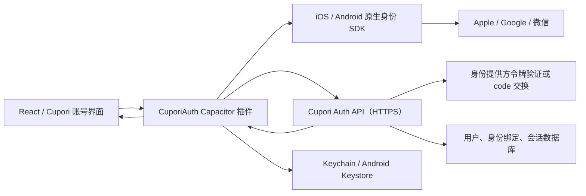

# Cupori 原生三方登录接入方案

**状态：方案草案，尚未接入生产环境**  
**更新日期：2026 年 8 月 13 日**

## 1. 结论

建议采用“原生身份提供方 SDK + 自有 Capacitor 插件 + 自有认证后端”的结构：

- iOS：Apple 使用 `AuthenticationServices`，Google 使用 Google Sign-In iOS
  SDK，微信使用微信开放平台 iOS SDK；
- Android：Google 使用 Credential Manager，微信使用微信 OpenSDK；Apple
  登录通过系统浏览器完成 OAuth，而不是嵌入 WebView；
- React WebView 只负责登录入口和账号界面，不直接保存第三方令牌；
- Apple 私钥、微信 `AppSecret` 等机密只允许放在服务端；
- 原生端只把一次性凭证交给后端，后端验证后签发 Cupori 自己的会话；
- Cupori 保持离线可用，登录仅用于可选的跨设备同步或账号能力，不阻塞本地记录。

在 iOS 中只要使用 Google 或微信作为主要账号登录方式，通常也必须同时提供符合
App Review Guideline 4.8 的等价隐私登录选项；对 Cupori 来说就是“通过 Apple
登录”。Apple 同时要求：如果核心功能不依赖账号，应允许用户不登录继续使用；
如果支持创建账号，则必须在应用内提供账号删除入口。

## 2. 总体架构



完整登录流程：

1. 原生插件向 Cupori 后端申请一次性登录挑战，取得 `attemptId`、`state` 和
   `nonce`；
2. 原生插件调用对应平台的官方 SDK；
3. SDK 返回 Apple 的 authorization code/ID token、Google ID token，或微信
   authorization code；
4. 原生插件通过 HTTPS 把一次性凭证和 `attemptId` 发给 Cupori 后端；
5. 后端校验签名、`issuer`、`audience`、过期时间、`state`、`nonce`，或在
   服务端完成 code 交换；
6. 后端用已验证的 provider subject 查找或创建 Cupori 用户，并签发 Cupori
   会话；
7. 原生插件把长期 refresh token 保存到 Keychain/Keystore，只把短期 access
   token 和必要的用户摘要返回给 React；
8. React 仅在内存中使用短期 access token。刷新和登出继续通过原生插件完成。

不要让 WebView、`localStorage` 或日志接触 Apple refresh token、微信
`AppSecret`、Cupori refresh token 等长期机密。

## 3. 推荐目录边界

先把插件作为 Cupori 的应用内原生模块实现；稳定并出现第二个使用方后，再考虑迁入
`@momots/capacitor-auth`。

```text
examples/cupori/
├── native/auth-plugin/
│   ├── src/definitions.ts
│   ├── src/index.ts
│   ├── ios/Sources/CuporiAuthPlugin/
│   │   ├── CuporiAuthPlugin.swift
│   │   ├── AppleAuthCoordinator.swift
│   │   ├── GoogleAuthCoordinator.swift
│   │   └── WeChatAuthCoordinator.swift
│   └── android/src/main/java/site/cupori/auth/
│       ├── CuporiAuthPlugin.kt
│       ├── GoogleAuthCoordinator.kt
│       └── WeChatAuthCoordinator.kt
└── src/auth/
    ├── client.ts
    ├── session.ts
    └── types.ts

apps/cupori-api/
├── src/routes/auth/
├── src/providers/apple.ts
├── src/providers/google.ts
├── src/providers/wechat.ts
└── src/services/session.ts
```

## 4. Capacitor 插件接口

建议让三种结果保持判别式联合类型，避免把不能互换的凭证混成一个可选字段对象：

```ts
export type AuthProvider = 'apple' | 'google' | 'wechat';

export type NativeProviderCredential =
  | {
      provider: 'apple';
      authorizationCode: string;
      identityToken: string;
      state: string;
      givenName?: string;
      familyName?: string;
    }
  | {
      provider: 'google';
      identityToken: string;
    }
  | {
      provider: 'wechat';
      authorizationCode: string;
      state: string;
    };

export interface CuporiSessionSummary {
  accessToken: string;
  expiresAt: string;
  user: {
    id: string;
    displayName?: string;
    avatarUrl?: string;
  };
}

export interface CuporiAuthPlugin {
  isAvailable(options: {
    provider: AuthProvider;
  }): Promise<{ available: boolean; reason?: string }>;

  signIn(options: {
    provider: AuthProvider;
  }): Promise<CuporiSessionSummary>;

  refresh(): Promise<CuporiSessionSummary>;
  signOut(): Promise<void>;
  deleteAccount(): Promise<void>;
}
```

`signIn()` 内部完成挑战申请、原生授权、后端交换和 refresh token 安全存储。
React 不应把客户端返回的 `userId`、`openid` 或邮箱直接当作已验证身份。

## 5. 认证后端

### 5.1 API

建议至少提供：

| 方法 | 路径 | 用途 |
| --- | --- | --- |
| `POST` | `/v1/auth/attempts` | 创建 5 分钟内有效的一次性 `state`/`nonce` |
| `POST` | `/v1/auth/exchanges` | 验证 provider 凭证并创建 Cupori 会话 |
| `POST` | `/v1/auth/refresh` | 轮换 Cupori refresh token，签发短期 access token |
| `POST` | `/v1/auth/logout` | 撤销当前设备会话 |
| `POST` | `/v1/auth/links` | 已登录用户显式绑定另一个身份提供方 |
| `DELETE` | `/v1/account` | 删除账号、云端数据和所有会话 |
| `GET/POST` | `/v1/auth/apple/callback` | Android/Web 的 Apple OAuth 回调 |
| `POST` | `/v1/auth/apple/events` | 接收 Apple 账号状态服务端通知 |

Android 上的 Apple 回调应先落到后端 HTTPS 地址；后端完成校验后，再通过一次性
app link 回到 Cupori。不要把 Apple authorization code 放在可长期复用的深链中。

### 5.2 数据模型

```text
users
  id, status, display_name, created_at, deleted_at

auth_identities
  id, user_id, provider, provider_subject,
  email, email_verified, created_at, last_login_at
  UNIQUE(provider, provider_subject)

provider_tokens
  identity_id, encrypted_refresh_token, rotated_at

sessions
  id, user_id, device_id, refresh_token_hash,
  expires_at, revoked_at, created_at

auth_attempts
  id, provider, state_hash, nonce_hash,
  expires_at, consumed_at
```

数据库只使用验证后的稳定 subject 建立身份：

- Apple：验证后 ID token 的 `sub`；
- Google：验证后 ID token 的 `sub`；
- 微信：优先使用满足开放平台条件时返回的 `unionid`，否则使用与该移动应用绑定的
  `openid`，并记录其作用域。

### 5.3 会话规则

- access token 建议有效 5～15 分钟，只存在于 WebView 内存；
- refresh token 使用高熵随机值，每次刷新都轮换，服务端只保存哈希；
- provider refresh token 如确需保存，必须由服务端加密保存；
- 登录挑战有效期不超过 5 分钟，只能消费一次；
- 登录、绑定和删除接口实施速率限制，并对敏感日志脱敏；
- iOS refresh token 保存在 Keychain 的 `ThisDeviceOnly` 项；Android 使用
  Keystore 支持的加密存储；
- 登出撤销 Cupori 会话；删除账号还需要撤销 provider token 并清除本地会话。

## 6. Apple 账号登录

### 6.1 iOS 配置

1. 在 Xcode 的 App Target → Signing & Capabilities 中添加
   **Sign in with Apple**；
2. 确认 App ID `site.cupori.app` 已在 Apple Developer 后台启用该能力；
3. 服务端创建 Sign in with Apple Key，安全保存 `.p8`、Key ID 和 Team ID；
4. 如需从 Android 或网页登录，创建 Services ID 和 HTTPS redirect URI，并将
   Services ID 与主 App ID 正确关联；
5. 如需向 Apple 私密转发地址发信，再配置 Private Email Relay。

原生请求核心结构：

```swift
let provider = ASAuthorizationAppleIDProvider()
let request = provider.createRequest()
request.requestedScopes = [.fullName, .email]
request.state = challenge.state
request.nonce = challenge.nonce

let controller = ASAuthorizationController(authorizationRequests: [request])
controller.delegate = coordinator
controller.presentationContextProvider = coordinator
controller.performRequests()
```

成功后只向后端传递：

- `authorizationCode`；
- `identityToken`；
- 与请求一致的 `state`/登录尝试标识；
- 首次授权时可能返回的姓名提示。

姓名和邮箱通常只在第一次授权时返回，不能假设以后每次都有。姓名不是用来验证
身份的凭证；账号身份必须来自服务端验证后的 `sub`。

### 6.2 服务端验证

服务端应：

1. 使用 Apple 公钥验证 ID token 签名；
2. 校验 `iss`、`aud`、`exp` 和 `nonce`；
3. 使用短期 authorization code 调用 Apple `/auth/token`；
4. 将返回的 Apple refresh token 加密保存，用于会话检查和删除账号时撤销；
5. 监听 `consent-revoked`、`account-deleted` 等服务端事件，并在原生端处理
   credential revoked 状态。

删除 Cupori 账号时，应调用 Apple `/auth/revoke` 撤销相关 token，然后删除
Cupori 服务端身份、会话和云端数据。

### 6.3 Android

Android 没有 `AuthenticationServices`。通过原生 Kotlin 使用 Chrome Custom
Tabs 或 AppAuth 打开 Apple 的系统网页授权页，回调到后端 HTTPS redirect URI；
不要把 Apple 登录页嵌入 Capacitor WebView。后端校验成功后，通过一次性 app link
把结果交还原生插件。

## 7. Google 账号登录

### 7.1 Google Cloud 配置

在同一个 Google Cloud 项目中创建：

- iOS OAuth client：绑定 `site.cupori.app`；
- Android OAuth client：绑定 Android package name 和发布证书 SHA-1/SHA-256；
- Web application OAuth client：作为后端的 server client ID，用于 ID token 的
  `audience`。

只请求认证所需的 `openid`、`email`、`profile`。如果 Cupori 不调用 Google
Drive、Calendar 等 API，就不要申请对应额外 scope。

### 7.2 iOS 原生接入

使用 Google 官方 `GoogleSignIn-iOS` Swift Package。按照控制台配置：

- `GIDClientID`；
- `GIDServerClientID`；
- iOS client ID 对应的 reversed URL scheme。

在 `AppDelegate` 中先让 Google 处理其回调，再保留 Capacitor 的默认处理：

```swift
func application(
    _ app: UIApplication,
    open url: URL,
    options: [UIApplication.OpenURLOptionsKey: Any] = [:]
) -> Bool {
    if GIDSignIn.sharedInstance.handle(url) {
        return true
    }
    return ApplicationDelegateProxy.shared.application(
        app,
        open: url,
        options: options
    )
}
```

交互登录使用 `GIDSignIn.sharedInstance.signIn(withPresenting:)`，必要时先刷新 SDK
令牌，然后只把 Google ID token 发送到 Cupori 后端。不要把客户端可修改的
Google user ID 或邮箱直接用作登录依据。

### 7.3 Android 原生接入

使用 Android Credential Manager 与 Google ID 库：

- 自动/底部面板流程使用 `GetGoogleIdOption`；
- 明确点击“通过 Google 登录”按钮时使用 `GetSignInWithGoogleOption`；
- `serverClientId` 使用 Web application client ID；
- 为请求设置高熵 nonce；
- 从 `GoogleIdTokenCredential` 取得 ID token 后交给 Cupori 后端验证。

后端验证 Google 签名以及 `iss`、`aud`、`exp`、`nonce`，并使用验证后的 `sub`
作为稳定身份。不要在生产环境依赖客户端提交的普通 user ID。

## 8. 微信登录

### 8.1 开放平台准备

1. 在微信开放平台创建并通过审核的“移动应用”；
2. 配置 iOS Bundle ID、Android package name 和正式签名；
3. 取得 AppID；AppSecret 只能存放在 Cupori 后端；
4. iOS 准备受控的 HTTPS 域名、Universal Link 和
   `apple-app-site-association` 文件；
5. 在 Xcode 添加 Associated Domains，并按当期微信 SDK 文档配置 URL scheme
   和可查询 scheme；
6. 使用真实安装了微信的设备测试，不能把模拟器作为微信回跳验收环境。

### 8.2 iOS 原生接入

- 集成微信官方 iOS OpenSDK；
- 启动时调用 `WXApi.registerApp(appId, universalLink: ...)`；
- 在 AppDelegate 的 `open url` 和 `continue userActivity` 中先交给微信 SDK，
  未处理时再交给 Capacitor；
- 登录时构造 `SendAuthReq`，scope 使用微信登录要求的 scope，并携带后端生成的
  一次性 `state`；
- `WXApiDelegate` 回调中只取得 authorization code，立即交给 Cupori 后端。

### 8.3 Android 原生接入

- 集成微信官方 Android OpenSDK，创建 `IWXAPI` 并注册 AppID；
- 使用 `SendAuth.Req` 发起授权，附带后端一次性 `state`；
- 按微信规范建立 `<applicationPackage>.wxapi.WXEntryActivity`，将 Intent 交给
  `IWXAPI.handleIntent()`；
- 在 `onResp` 中区分成功、取消和失败，成功时只把 code 发给 Cupori 后端；
- 发布签名必须与微信开放平台登记的签名一致。

### 8.4 服务端交换

后端校验一次性 `state` 后，使用 AppID、AppSecret 和 code 调用微信服务端完成
authorization code 交换。AppSecret 绝不能编译进 Swift、Kotlin、TypeScript
或配置文件。

如果仅为登录，不要额外获取和长期保存不需要的昵称、头像、地区等资料。只有在产品
明确需要、用户已经授权且隐私政策已经披露时，才调用用户信息接口。

## 9. 账号绑定与本地数据

Cupori 不能仅凭邮箱相同自动合并账号：Apple 可能提供私密转发邮箱，Google 账号
也可能使用第三方邮箱，自动合并会造成账号接管风险。

采用以下规则：

1. 首次通过任一 provider 登录时创建 Cupori 用户；
2. 只有在用户已登录、重新验证当前会话，并主动点击“绑定 Apple/Google/微信”时，
   才把新 provider identity 绑定到同一用户；
3. 如果新 provider identity 已属于其他 Cupori 用户，停止操作并进入人工可解释的
   冲突流程，不能静默合并；
4. 每个账号应保留至少一个可用登录方式；解绑最后一个身份前先绑定另一个；
5. 登录后不要自动上传原有 SQLite 和照片。先询问用户是否启用云同步，再执行可恢复
   的首次合并；
6. 离线记录继续以本地稳定 ID 和 revision 为基础，为后续同步冲突处理预留空间。

“退出登录”只结束账号会话，不应默认删除本地离线记录。“删除账号”则必须删除账号、
服务端身份、会话和云端数据；如果允许保留本地副本，应在确认页清楚说明，并默认提供
先导出再删除的路径。

## 10. 隐私与商店合规

登录功能上线前必须同步完成：

- 更新 `PRIVACY.md`，加入身份提供方、处理的数据、用途、共享对象、保存期限和
  删除方法；
- 更新 App Store Connect App Privacy 和 Google Play Data safety；
- iOS 同时提供 Apple 登录，并保持与 Google/微信入口同等级、易发现；
- 不强制用户登录才能使用本地记录、月历和统计；
- 在设置页提供“删除账号”，不能只提供“退出登录”；
- Apple 账号删除时撤销 Sign in with Apple token；
- Google Play 还需要一个无需安装应用即可发起账号删除的公开网页；
- 提供可公开访问的隐私政策 URL 和隐私联系邮箱；
- 不把 provider token、authorization code、邮箱或用户 ID 写入分析与错误日志。

登录上线后，通常至少需要重新评估并披露：用户 ID、可选姓名、可选邮箱、头像、
认证信息、诊断数据，以及启用云同步后上传的饮品记录和照片。最终申报应以发布构建
及所有内置第三方 SDK 的实际行为为准。

## 11. 错误和取消语义

三端统一映射为以下可判别结果，避免把用户取消显示成系统错误：

```ts
type AuthFailureKind =
  | 'cancelled'
  | 'provider-unavailable'
  | 'network-unavailable'
  | 'invalid-state'
  | 'credential-rejected'
  | 'identity-conflict'
  | 'server-unavailable';
```

- 微信未安装：显示可解释提示，并让用户选择 Apple/Google 或稍后再试；
- 用户取消：安静返回登录页，不显示红色故障警报；
- 网络不可用：保留本地功能，允许稍后重试；
- token 无效、`state`/`nonce` 不匹配：服务端拒绝并记录脱敏安全事件；
- 账号冲突：不自动合并，给出绑定或联系客服的明确路径。

## 12. 验收清单

### 安全

- [ ] 错误 `audience`、过期 token、错误签名全部被后端拒绝；
- [ ] `state`、`nonce` 和 authorization code 不能重放；
- [ ] Apple 私钥、微信 AppSecret 不存在于 App 包和源码前端产物；
- [ ] refresh token 不进入 `localStorage`、IndexedDB、URL 或日志；
- [ ] refresh token 轮换、撤销和多设备退出经过测试；
- [ ] 账号绑定不能只依赖邮箱相同。

### iOS

- [ ] Apple 首次登录、隐藏邮箱、再次登录缺少姓名时均正常；
- [ ] Google URL scheme 回调后 Capacitor 其他深链仍正常；
- [ ] 微信 Universal Link 在真实设备冷启动和热启动均可返回；
- [ ] provider 取消、系统未登录、凭证被撤销时状态正确；
- [ ] TestFlight 构建可以登录、退出、删除账号并重新注册。

### Android

- [ ] Google Credential Manager 自动流程和显式按钮流程均可用；
- [ ] 微信 debug/release 签名分别按环境登记并验证；
- [ ] Apple Custom Tab 回调不会泄漏 authorization code；
- [ ] 无 Google 账号、无微信、离线和 Activity 重建均有恢复路径。

### 产品与合规

- [ ] 未登录用户可以继续使用 Cupori 本地核心功能；
- [ ] 登录前明确说明登录带来的能力，例如云同步；
- [ ] 首次云同步前明确征得用户选择，不静默上传历史照片；
- [ ] App 内有账号删除入口，Google Play 有公开删除网页；
- [ ] 隐私政策、商店隐私问卷与最终二进制行为一致。

## 13. 推荐实施顺序

1. 先搭建认证后端、会话轮换、Keychain/Keystore 和账号删除；
2. 接入 iOS Apple 登录，打通完整的创建、刷新、退出、撤销和删除闭环；
3. 接入 iOS Google 登录，并实现显式账号绑定；
4. 完成微信开放平台审核、域名和 Universal Link 后接入 iOS 微信；
5. 增加 Android 工程，依次接入 Google、微信和 Apple Web OAuth；
6. 最后实现可选云同步和本地数据首次合并，不要让登录改造阻塞当前离线 MVP。

## 14. 官方参考

- [Apple App Review Guidelines](https://developer.apple.com/app-store/review/guidelines/)
- [配置 Sign in with Apple](https://developer.apple.com/documentation/xcode/configuring-sign-in-with-apple)
- [使用 AuthenticationServices 实现 Apple 登录](https://developer.apple.com/documentation/authenticationservices/implementing-user-authentication-with-sign-in-with-apple)
- [Apple token validation](https://developer.apple.com/documentation/signinwithapplerestapi/generate-and-validate-tokens)
- [Apple token revocation](https://developer.apple.com/documentation/signinwithapplerestapi/revoke-tokens)
- [Apple 账号删除与 token 撤销 TN3194](https://developer.apple.com/documentation/technotes/tn3194-handling-account-deletions-and-revoking-tokens-for-sign-in-with-apple)
- [Google Sign-In for iOS：开始接入](https://developers.google.com/identity/sign-in/ios/start-integrating)
- [Google Sign-In for iOS：服务端认证](https://developers.google.com/identity/sign-in/ios/backend-auth)
- [Android Credential Manager：Sign in with Google](https://developer.android.com/identity/sign-in/credential-manager-siwg-implementation)
- [微信开放平台：移动应用微信登录开发指南](https://developers.weixin.qq.com/doc/oplatform/Mobile_App/WeChat_Login/Development_Guide.html)
- [Capacitor 官方文档](https://capacitorjs.com/docs)
- [App Store Connect：管理 App 隐私](https://developer.apple.com/help/app-store-connect/manage-app-information/manage-app-privacy/)
- [Google Play 账号删除要求](https://support.google.com/googleplay/android-developer/answer/13327111)
