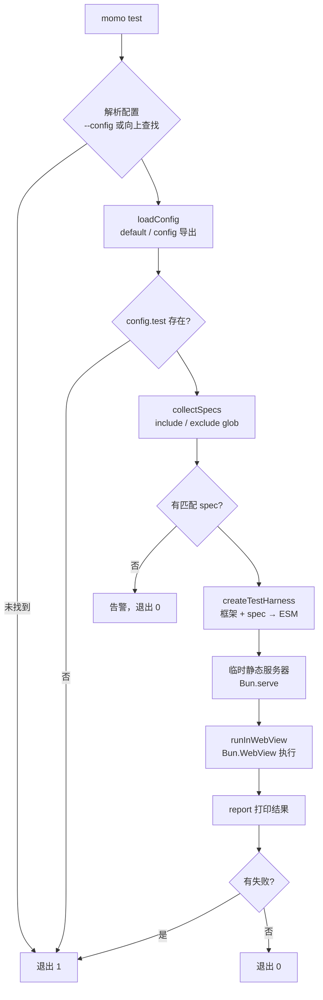

本页说明 `momo` 命令、配置系统以及 `@momots/cli/test` 的测试 API。

## CLI 命令

| 命令 | 说明 | 退出码 |
| --- | --- | --- |
| `momo test` | 在最近的 `momo.config.*` 指定的 `Bun.WebView` 中运行 spec | 通过 `0` / 失败或出错 `1` |
| `momo help` / `-h` / `--help` | 显示帮助 | `0` |
| *(无命令)* | 显示帮助 | `1` |

### momo test 选项

| 选项 | 说明 |
| --- | --- |
| `-c, --config <path>` | 显式指定 `momo.config.*`（相对 cwd 或绝对路径），跳过向上查找 |
| `-h, --help` | 显示帮助 |

```bash
momo test
momo test -c packages/host/momo.config.ts
momo --help
```

### test 命令执行流程



## 配置

### defineConfig

```ts
function defineConfig(config: MomoConfig): MomoConfig;
```

用于类型推导与自动补全，原样返回传入配置。

```ts
import { defineConfig } from '@momots/cli';
// 或 import { defineConfig } from '@momots/cli/config';

export default defineConfig({ test: { include: ['**/*.webview.spec.ts'] } });
```

### 配置类型

```ts
type MomoWebViewBackend = 'webkit' | 'chrome';

interface MomoTestConfig {
  include: string | string[];   // 必填，相对配置目录的 glob
  exclude?: string | string[];
  width?: number;               // 默认 1280
  height?: number;              // 默认 720
  backend?: MomoWebViewBackend; // 默认 'webkit'
  html?: string;                // 注入 <body> 的初始 HTML
}

interface MomoConfig {
  test?: MomoTestConfig;
}
```

### 配置文件发现

从配置目录向上依次查找：`momo.config.ts`、`momo.config.mts`、`momo.config.js`、`momo.config.mjs`。

## 测试 API（@momots/cli/test）

无依赖、可在浏览器运行的轻量测试框架。spec 在 import 时注册测试，CLI 通过内部 `run()` 执行。

### 注册与分组

```ts
function describe(name: string, fn: () => void): void;
function test(name: string, fn: TestFn): void;
// test.skip / test.only
const it = test; // 别名
```

```ts
describe('套件', () => {
  test('用例', () => expect(1).toBe(1));
  test.skip('暂时跳过', () => {});
  test.only('只跑这个', () => {}); // 存在任一 .only 时，其余被跳过
});
```

### 生命周期钩子

```ts
function beforeAll(hook: Hook): void;
function afterAll(hook: Hook): void;
function beforeEach(hook: Hook): void;
function afterEach(hook: Hook): void;
```

`beforeAll/afterAll` 每个套件执行一次；`beforeEach/afterEach` 每个用例前后执行（被嵌套套件继承）。

### expect 断言

```ts
function expect<T>(received: T): Expectation<T>;
```

`Expectation` 在 `Matchers` 基础上提供 `.not` 取反。常用匹配器：

| 匹配器 | 说明 |
| --- | --- |
| `toBe` / `toEqual` / `toStrictEqual` | 相等 / 深相等 |
| `toBeTruthy` / `toBeFalsy` | 真值 / 假值 |
| `toBeNull` / `toBeUndefined` / `toBeDefined` / `toBeNaN` | 特殊值 |
| `toBeInstanceOf` | 实例判断 |
| `toContain` / `toHaveLength` | 包含 / 长度 |
| `toBeGreaterThan(OrEqual)` / `toBeLessThan(OrEqual)` | 数值比较 |
| `toMatch` | 字符串 / 正则匹配 |
| `toThrow` | 抛错断言 |

```ts
expect(value).not.toBe(0);
expect([1, 2, 3]).toHaveLength(3);
expect(() => { throw new Error('fail'); }).toThrow('fail');
```

### 结果类型

```ts
interface SerializedError { readonly message: string; readonly stack?: string }

interface TestResult {
  readonly name: string;                      // 'suite > nested > test' 路径
  readonly status: 'passed' | 'failed' | 'skipped';
  readonly duration: number;
  readonly error?: SerializedError;
}

interface RunResult {
  readonly total: number;
  readonly passed: number;
  readonly failed: number;
  readonly skipped: number;
  readonly results: TestResult[];
}
```

这些类型也从 `@momots/cli` 主入口重新导出。

## WebView 运行细节

- 打包：`Bun.build`，`format: 'esm'`、`target: 'browser'`；插件把匹配的 spec 标记为 `sideEffects: true`，避免在 `sideEffects: false` 的宿主包里被 tree-shaking 丢弃注册。
- 页面：在临时目录写入 `index.html` 与 ESM 入口，由 `Bun.serve` 提供静态服务；WebView `navigate` 到 `http://127.0.0.1:<port>/`，模块加载后 `evaluate` 调用 `__momoRun()` 取回 `RunResult`。
- 后端：`webkit`（默认，macOS 零依赖）或 `chrome`。
- 测试运行在本地 HTTP 页面上，`location.protocol` 通常是 `http:`。

可复制片段见 [示例](/docs/cli/examples)。
