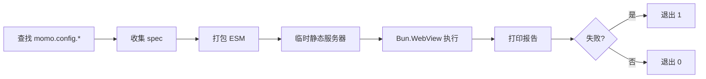

`@momots/cli` 提供 `momo` 命令行工具，核心能力是在 **真实的 `Bun.WebView`**（WebKit 或 Chrome 后端）中运行测试，而不是在 Node/Bun 的非浏览器运行时里。

这对依赖真实 DOM、布局、滚动、触摸、`window` 等浏览器能力的测试尤其有用。

## 前置条件

- **仅支持 Bun**：二进制入口为 `#!/usr/bin/env bun`，使用 `Bun.build`、`Bun.Glob`、`Bun.WebView`。
- 运行浏览器测试需要 `Bun.WebView` 可用（macOS 上默认零依赖 WebKit）。

## 安装

```bash
bun add -d @momots/cli
```

## 三步上手

### 1. 写配置 `momo.config.ts`

```ts
import { defineConfig } from '@momots/cli';

export default defineConfig({
  test: {
    // 仅匹配需要浏览器的 spec；其它 *.spec.ts 用 `bun test`
    include: ['src/**/webview.spec.ts'],
    html: '<main id="app"></main>',
  },
});
```

### 2. 写一个浏览器测试

```ts
import { describe, test, expect } from '@momots/cli/test';

describe('真实浏览器环境', () => {
  test('能访问 DOM', () => {
    const el = document.createElement('div');
    expect(el.tagName).toBe('DIV');
  });
});
```

### 3. 运行

```bash
momo test
```

`momo test` 的执行流程：



## 入口一览

| 子路径 | 内容 |
| --- | --- |
| `@momots/cli` | `defineConfig` + 配置/结果类型 |
| `@momots/cli/config` | 配置类型与 `defineConfig` |
| `@momots/cli/test` | 测试 API：`describe`、`test`、`expect`、生命周期钩子 |

继续阅读 [教程](/docs/cli/tutorial) 完成一个端到端的浏览器测试，或查阅 [向导](/docs/cli/guide)。
