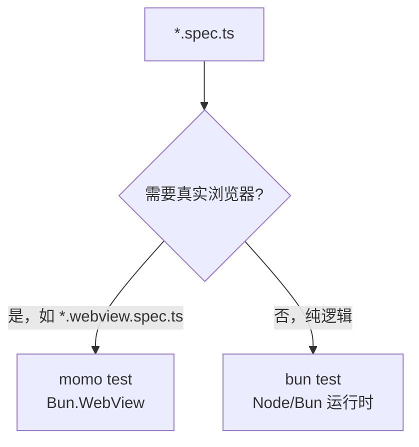

本教程端到端地完成一次浏览器测试：编写配置、实现一个渲染函数、为它写真实 DOM 测试，并用 `momo test` 运行。

## 第 1 步：编写 momo.config.ts

在包根目录创建配置。`test.include` 是**必填**项，相对于配置文件所在目录解析。`html` 会注入到测试页面的 `<body>`：

```ts
import { defineConfig } from '@momots/cli';

export default defineConfig({
  test: {
    include: ['src/**/*.webview.spec.ts'],
    html: '<main id="app"></main>',
    width: 1280,   // 视口宽，默认 1280
    height: 720,   // 视口高，默认 720
    backend: 'webkit', // 'webkit'（默认）| 'chrome'
  },
});
```

## 第 2 步：实现待测代码

`src/widget.ts`：

```ts
export function renderButton(root: HTMLElement, label: string) {
  const btn = document.createElement('button');
  btn.textContent = label;
  root.appendChild(btn);
  return btn;
}
```

## 第 3 步：写浏览器测试

`src/widget.webview.spec.ts`：

```ts
import { afterEach, describe, expect, test } from '@momots/cli/test';

import { renderButton } from './widget';

afterEach(() => {
  document.querySelector('#app')!.innerHTML = '';
});

describe('widget 在真实浏览器中', () => {
  test('渲染带文案的按钮', () => {
    renderButton(document.querySelector('#app')!, '点我');

    const btn = document.querySelector('button');
    expect(btn).toBeDefined();
    expect(btn!.textContent).toBe('点我');
    expect(document.querySelectorAll('button')).toHaveLength(1);
  });

  test('存在浏览器全局对象', () => {
    expect(typeof window).toBe('object');
  });

  test('支持异步断言', async () => {
    const n = await Promise.resolve(42);
    expect(n).toBe(42);
    expect(n).not.toBe(43);
  });
});
```

## 第 4 步：运行

```bash
# 在含 momo.config.ts 的目录执行（会向上查找）
momo test

# 或显式指定配置
momo test --config packages/my-pkg/momo.config.ts
momo test -c ./momo.config.ts
```

输出大致如下：

```text
在 Bun.WebView 中运行 1 个 spec 文件…

✓ widget 在真实浏览器中 > 渲染带文案的按钮 (2.1ms)
✓ widget 在真实浏览器中 > 存在浏览器全局对象 (0.5ms)
✓ widget 在真实浏览器中 > 支持异步断言 (0.3ms)

WebView 3 passed (3 total)
```

成功退出码 `0`；任一失败或配置缺失/非法时退出码 `1`。

## 第 5 步：双轨测试（推荐）

把测试分成两类，各取所长：



`package.json`：

```json
{
  "scripts": {
    "test": "bun test src",
    "test:webview": "momo test"
  }
}
```

> 这正是 `@momots/host` 的做法：`momo.config.ts` 只 `include: ['src/**/webview.spec.ts']`，其余守卫的纯逻辑测试走 `bun test`。

完整 API 见 [向导](/docs/cli/guide)。
