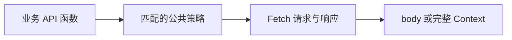

`@momots/drive` 是一层建立在 Fetch API 之上的请求编排工具。它保留
`Headers`、`Response`、`AbortSignal`、`ReadableStream` 等平台概念，同时让鉴权、
日志、错误转换和其他公共策略可以按路径组合，而不必散落在每个接口函数里。

## 它解决什么问题

随着接口增多，请求代码真正难维护的部分通常不是 `fetch()` 本身，而是不断重复的
外围规则：哪些接口需要令牌、哪些响应需要审计、哪个业务域使用哪套策略，以及何时
需要读取状态码或流。

Drive 的目标是把这两类代码分开：

- **接口函数表达业务意图**：访问哪个地址、使用哪种数据通道、期望什么结果；
- **客户端表达传输策略**：哪些请求应用鉴权、日志、错误处理或重复发送规则。

本文把共享同一组传输规则的请求集合称为“服务边界”。同一域名、同一后端服务或同一套
认证规则，都可以构成这样的边界。

因此，Drive 更适合拥有多个接口或多个业务域的应用。若项目只有少量互不相关的请求，
直接使用原生 `fetch` 往往更清楚。

## 设计思路

Drive 围绕三个选择组织 API。

### 1. 明确数据要去哪里

对象式调用把请求数据分成三个互不含糊的通道：

| 字段 | 目的 | 接受的值 |
| --- | --- | --- |
| `query` | 写入 URL 查询参数 | `URLSearchParams` |
| `json` | 发送 JSON | 任意可被当前 stringifier 序列化为字符串的值 |
| `body` | 使用 Fetch 原生请求体 | `BodyInit \| null` |

`json` 与 `body` 不能同时出现。`query` 只改变 URL，不会创建请求体；URL 中已有的查询
参数和 fragment 会保留，但 fragment 不会进入 HTTP 请求。

对象式请求、`request()` 与 `exec()` 也接受 `data`。快捷方法的位置式
`get(api, data, init)`（其他方法同理）只是把第二参映射到同一个自动通道：

- `URLSearchParams` 进入 query；
- 普通对象与数组按 JSON 发送；
- 支持的原生 body 对象原样交给 Fetch。

两种风格能力相同。对象式适合强调数据意图，位置式适合简单、稳定且含义明显的调用。
不要同时用 `data` 和显式字段表达同一个通道。

### 2. 按需要选择返回结果

| 入口 | 适用目的 | 返回值 |
| --- | --- | --- |
| `get`、`post` 等快捷方法 | 只关心解析后的响应体 | `Promise<T>` |
| `exec` | 使用自定义 HTTP 方法，但仍只关心响应体 | `Promise<T>` |
| `request` | 需要状态码、响应头、原始响应或响应流 | `Promise<DriveFetchedContext<T>>` |

快捷方法与 `exec()` 的泛型 `T` 是调用方对接口契约的断言，不是运行时校验。已知响应为空
时使用 `void`；响应体可能不存在时使用 `T | undefined`；需要亲自判断时使用
`request()`，因为它的 `res.body` 始终是可选字段。默认响应解析器（parser）根据响应头
和响应内容选择解析方式，`T` 不参与这项选择。

### 3. 把公共策略放到边界上

中间件通过路径或谓词选择请求，并采用洋葱式执行语义：`await next()` 之前处理请求，
之后处理响应。业务域越清晰，中间件的职责也越容易保持单一。



Drive 不默认把 `4xx` 或 `5xx` 判为异常，也不默认缓存或重复发送。不同协议和业务对
“失败”的定义不同，这些决定应由中间件、`repeat` 或 TanStack Query、Effect 等上层
工具承担。

## 如何开始

### 安装

当前版本为 alpha：

```bash
bun add @momots/drive@alpha @momots/core@alpha remeda
```

`@momots/core` 与 `remeda` 是 peer dependencies，需要由应用一并安装。

Drive 面向提供现代 Fetch 与 Stream API 的运行时，主要包括 Bun、现代浏览器和现代
Node.js。若运行时缺少相应 Web API，应由应用提供兼容层。

Drive 不提供 `baseURL`，也不会自行解析相对地址。浏览器通常可以按当前 origin 发送
`/api/...`；Bun 与 Node.js 通常需要绝对 URL。下方网站示例假设运行在浏览器同源环境，
未定义的 `getToken()` 等标识符代表应用侧依赖。

### 创建服务边界

建议为一个服务边界创建一个 Drive 实例，再按业务域导出 API 函数。

```ts
import { Drive } from "@momots/drive";

export const drive = new Drive().use("/api/**", async (context, next) => {
  context.req.headers.set("Authorization", `Bearer ${getToken()}`);
  await next();
});

type User = { id: string; name: string };

export const UserApi = {
  list: (page: number) =>
    drive.get<User[]>({
      api: "/api/users",
      query: new URLSearchParams({ page: String(page) }),
    }),
  create: (name: string) =>
    drive.post<User>({ api: "/api/users", json: { name } }),
  remove: (id: string) =>
    drive.delete<void>({ api: `/api/users/${id}` }),
};
```

这个结构让页面和业务逻辑只依赖 `UserApi`，而令牌、日志或错误策略集中在服务边界。

### 在需要元数据时升级到 `request()`

```ts
async function findUser(id: string): Promise<User | undefined> {
  const context = await drive.request<User>({
    api: `/api/users/${id}`,
    method: "GET",
  });

  if (context.res.status === 404) return undefined;
  if (context.res.status >= 400) {
    throw new Error(`HTTP ${context.res.status}`);
  }
  return context.res.body;
}
```

`request()` 成功返回时，`raw`、`status` 与 `headers` 一定存在；parser 是否得到 body
则取决于响应内容和解析策略。

## 明确的职责边界

Drive 负责：

- 组织 Fetch 请求参数和响应元数据；
- 解析常见 JSON、文本与附件响应；
- 按路径或谓词组合中间件；
- 在调用方明确要求时提供流进度与重复发送策略。

Drive 不负责：

- 推断后端业务模型或校验泛型 `T`；
- 自动将 HTTP 状态码转换成业务异常；
- 自动判断写请求是否可以安全重放；
- 代替缓存、服务端状态或 UI 加载状态工具。

这些边界能避免客户端悄悄替业务做决定，也让每一种策略都有清晰的归属。

## 下一步读什么

| 你的问题 | 阅读 |
| --- | --- |
| 为什么采用中间件、Context 和显式数据通道？ | [理念](/docs/drive/philosophy) |
| 如何建立一个可用的客户端？ | [教程](/docs/drive/tutorial) |
| 常见任务如何写？ | [示例](/docs/drive/examples) |
| 某个字段、重载或类型的精确含义是什么？ | [API 参考](/docs/drive/guide) |
