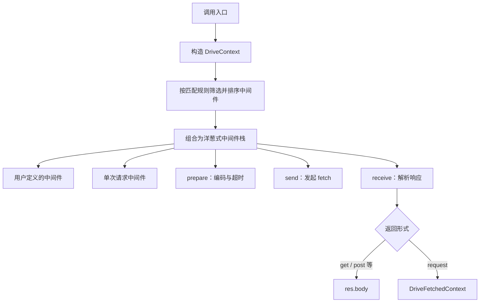

## 1. 概述

`@momots/drive` 是一个基于浏览器 **Fetch API** 的 HTTP 客户端库。它将一次 HTTP 交互组织为若干可组合的处理阶段，并采用与 Koa 框架类似的 **洋葱模型中间件** 结构：每个中间件在调用 `next()` 之前执行请求侧逻辑，在 `next()` 返回之后执行响应侧逻辑。

本库提供以下能力：

1. 按 URL 路径或自定义谓词条件选择并执行中间件；
2. 在发送请求前自动编码 URL、请求体与请求头；
3. 在收到响应后按内容类型解析响应体；
4. 通过 `get`、`post` 等方法提供简化的调用接口；
5. 提供可选的 `repeat` 发送阶段，由应用传入继续条件与等待策略。

### 1.1 职责范围

Drive 的设计定位是 **传输层（transport layer）** 编排：负责发起 HTTP 请求、编解码数据，以及通过中间件注入与具体路径相关的公共逻辑（例如身份验证、日志记录）。

以下能力 **不在** 本库默认行为范围内，而应由可选阶段、中间件或上层应用库自行定义：

- 根据 HTTP 状态码自动抛出异常；
- 根据 HTTP 状态或网络错误自动重试；
- 响应数据的缓存；
- 全局加载状态的管理。

上述策略因项目而异，本库将其留给 [中间件](/docs/drive/philosophy)、[可选的 repeat 发送阶段](/docs/drive/tutorial#第-8-步按外部策略重复发送请求)、[Effect](https://effect.website/) 或 [TanStack Query](https://tanstack.com/query/latest) 等上层模块处理。

### 1.2 适用场景

当项目需要在多个 API 之间统一处理身份验证、日志、错误转换或按业务域划分 HTTP 逻辑时，Drive 提供结构化的扩展方式。若仅需偶尔调用少量接口，直接使用原生 `fetch` 通常更为合适。

## 2. 安装

```bash
bun add @momots/drive @momots/core @momots/host remeda
```

`@momots/core`、`@momots/host`、`remeda` 为 **同级依赖（peer dependencies）**，须由使用方项目一并安装。

## 3. 运行环境

Drive 面向现代 Web API 运行时，默认实现依赖下列全局能力：

- `fetch`、`Response`、`Headers` 与 `RequestInit`；
- `URL` 与 `URLSearchParams`；
- `AbortController` / `AbortSignal`（使用 `timeout` 或请求取消时需要）；
- `ReadableStream`、`Blob`、`FormData` 等原生 body 类型（仅在传入相应数据时需要）。

Bun、现代 Node.js 与现代浏览器通常已提供这些能力；旧浏览器或受限运行时需要由应用侧提供 polyfill。

## 4. 阅读顺序

建议按下列顺序阅读文档，以便由概念到实践逐步建立理解：

| 顺序 | 章节                           | 内容                                     |
| ---- | ------------------------------ | ---------------------------------------- |
| 1    | 本页                           | 概述、安装、最小示例、与其他库的比较     |
| 2    | [理念](/docs/drive/philosophy) | 设计原则、中间件模型、路径匹配规则       |
| 3    | [教程](/docs/drive/tutorial)   | 构造客户端、请求编码、响应解析与进度回调 |
| 4    | [示例](/docs/drive/examples)   | 常见用法的参考实现                       |
| 5    | [向导](/docs/drive/guide)      | 类、函数与类型的完整说明                 |

## 5. 最小示例

下列代码展示 Drive 的基本用法：

```ts
import { Drive } from "@momots/drive";

export const drive = new Drive();

type User = { id: string; name: string };

// 快捷方法返回经解析的响应体；泛型 T 由调用方指定
const user = await drive.get<User>("/api/users/1");

// 传入普通对象时，库将自动序列化为 JSON 并设置 Content-Type
const created = await drive.post<User>("/api/users", { name: "Ada" });

// 需要读取状态码、响应头或原始 Response 对象时，使用 request 方法
const ctx = await drive.request<User>({ api: "/api/users/1" });
ctx.res.status; // number
ctx.res.raw; // Response
ctx.res.body; // User | undefined
```

## 6. 请求处理流程

每次调用 `get(...)` 或 `request(opts)` 时，库按固定顺序执行下列步骤：



从功能上，Drive 可分为三个层次：

| 层次     | 说明                                                                  | 主要接口                            |
| -------- | --------------------------------------------------------------------- | ----------------------------------- |
| 请求入口 | 发起 HTTP 请求；返回响应体或完整上下文                                | `get`、`post`、`request`            |
| 中间件   | 在请求生命周期中插入公共逻辑                                          | `use(pattern, middleware)`          |
| 编解码   | 将 `data` 编码为 URL、请求体与请求头；将 `Response` 解析为 `res.body` | `stringifier`、`parser`、`receiver` |

## 7. 设计特点

### 6.1 结构简单

- 核心实现规模较小，不依赖 XMLHttpRequest，也不内置复杂的状态机；
- 直接基于 Fetch API 的类型与对象（`RequestInit`、`Headers`、`AbortSignal`），不引入额外的 HTTP 抽象层；
- 提供两种调用方式：快捷方法返回响应体；`request` 方法返回包含元数据的完整上下文；
- 内置处理流程固定为三个阶段——`prepare`（准备）、`send`（发送）、`receive`（接收），职责划分清晰。

### 6.2 易于扩展

下列扩展点均可在 **实例级** 或 **单次请求级** 覆盖：

| 扩展点                             | 作用                                       |
| ---------------------------------- | ------------------------------------------ |
| `use(pattern, middleware)`         | 按路径或谓词注册中间件                     |
| `prepare` / `send` / `receive`     | 替换编码、传输或解析阶段的实现             |
| `parser` / `stringifier` / `stamp` | 自定义响应解析、请求体序列化、请求标识生成 |

例如，测试环境中可将 `send` 替换为不访问网络的实现；业务中可通过自定义 `parser` 处理非标准响应格式；中间件中可封装公共请求头、鉴权、日志记录等逻辑。本库提供扩展接口，具体策略由应用代码决定。

### 6.3 与上层库的分工

Drive 不在内部定义「何种 HTTP 响应应视为错误」。例如，REST 接口可能在 404 时仍返回结构化 JSON；GraphQL 可能在 HTTP 200 的响应体中包含错误字段。因此：

- 调用方决定快捷方法的泛型是否包含 `undefined`，也可通过 `request()` 精确检查响应体是否存在；
- 错误判定与按响应结果重试可交由 Effect、TanStack Query 或自定义 `send` 阶段实现；仅按请求快照与业务条件重复发送时，也可使用可选的 `repeat` 阶段。

## 8. 与其他 HTTP 客户端的比较

| 特性            | **Drive**                        | **fetch**  | **ky**           | **ofetch**        | **axios**          |
| --------------- | -------------------------------- | ---------- | ---------------- | ----------------- | ------------------ |
| 底层 API        | Fetch                            | Fetch      | Fetch            | Fetch             | XHR / Fetch 适配器 |
| 中间件模型      | 洋葱模型 + 路径匹配              | 无         | 钩子函数         | 钩子函数          | 请求/响应拦截器    |
| 按路径注册逻辑  | 支持                             | 不支持     | 不支持           | 不支持            | 不支持             |
| 处理阶段可替换  | 支持（prepare / send / receive） | 不支持     | 部分支持         | 部分支持          | 通过适配器         |
| 默认对 4xx 抛错 | 否（由外部决定）                 | 否         | 是               | 可配置            | 可配置             |
| 默认自动重试    | 否（提供可选 repeat 阶段）       | 否         | 是               | 是                | 否（需插件）       |
| 体量与复杂度    | 较小                             | 无额外依赖 | 较小             | 中等              | 中等               |
| 典型用途        | 多域 API 与可组合的中间件逻辑    | 单次请求   | Fetch 的便捷封装 | 全功能 Fetch 封装 | 传统拦截器模式     |

Drive 在功能丰富度上介于轻量封装（如 ky）与全功能客户端（如 ofetch、axios）之间：它通过中间件与路径匹配提供更强的组合能力，同时避免引入适配器体系等较重的设计。

## 9. 其他章节

- [理念](/docs/drive/philosophy) — 设计原则与中间件组织方式
- [教程](/docs/drive/tutorial) — 从零构造可用的 API 客户端
