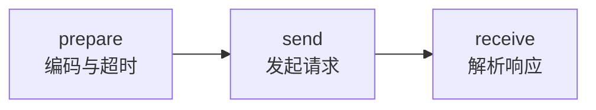
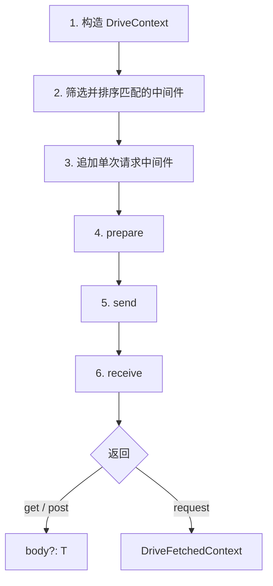
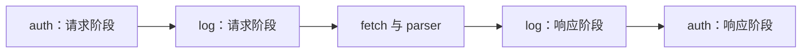

## 1. 设计目标

`@momots/drive` 的设计目标，是将 HTTP 请求的处理过程分解为若干职责单一、可独立组合的处理单元。业务代码只需声明「访问哪个接口」，而与路径相关的公共逻辑（如身份验证、日志记录）则通过中间件按条件注入。

## 2. 设计原则

### 2.1 基于 Fetch API，保持接口一致

Drive 是构建在 Fetch API 之上的编排层，而非另一套独立的 HTTP 抽象。具体表现为：

- **请求侧**：`RequestInit`、`Headers`、`AbortSignal` 等对象原样传递，不做额外转换；
- **响应侧**：保留原生 `Response` 对象，解析结果写入 `ctx.res.body`；
- **未内置的能力**：重试、异常抛出、缓存等，以避免与 Effect、TanStack Query 等上层库功能重复。

因此，熟悉 Fetch API 的开发者可以较低成本地理解本库的行为；同时，本库的实现可随平台 API 的演进而自然兼容。

### 2.2 以中间件实现关注点分离

在传统的 HTTP 封装中，常将 URL 拼接、请求头设置、状态码处理、日志记录、令牌刷新等逻辑集中在一个函数内。随着接口数量增加，此类函数难以复用与维护。

Drive 采用 **单一职责** 的中间件模式，建议将不同关注点拆分为独立中间件：

| 中间件类型 | 职责                                       |
| ---------- | ------------------------------------------ |
| 身份验证   | 读取令牌并写入 `Authorization` 请求头      |
| 日志       | 记录请求路径、耗时与响应状态码             |
| 错误处理   | 根据状态码转换或抛出异常（亦可交由上层库） |
| 域相关逻辑 | 仅注册在对应路径下，不影响其他请求         |

```ts
import { Drive } from "@momots/drive";

export const drive = new Drive()
  .use("/api/**", async (ctx, next) => {
    const token = localStorage.getItem("token");
    if (token) ctx.req.headers.set("Authorization", `Bearer ${token}`);
    await next();
  })
  .use("/api/admin/**", async (ctx, next) => {
    const user = await getCurrentUser();
    if (!user.isAdmin) throw new Error("无权限访问");
    await next();
  });
```

### 2.3 三阶段处理管线

每次请求的内置处理流程固定为三个阶段，每个阶段均以 **工厂函数** 形式提供，可在实例级或单次请求级替换：



| 阶段        | 职责                                                                      |
| ----------- | ------------------------------------------------------------------------- |
| **prepare** | 调用 `ctx.encode()`，完成 URL、请求体与请求头的编码；可选设置超时         |
| **send**    | 调用 `fetch` 发起网络请求，保存原始 `Response` 至 `res.raw`，并解析响应头 |
| **receive** | 调用 `parser` 将响应体解析并写入 `res.body`                               |

用户定义的中间件在 **prepare 阶段之前** 执行，此时 `encode()` 尚未调用。若需在编码前修改请求体或 HTTP 方法，须手动设置相应字段，或替换 `prepare` 阶段的实现。

### 2.4 完整请求处理管线



> 用户定义的中间件在 `encode()` 调用 **之前** 执行。

### 2.4 错误与重试由外部定义

Drive **不会** 因 HTTP 4xx 或 5xx 状态码自动抛出异常。理由如下：

- REST 风格接口可能在 404 响应中仍返回结构化的错误信息；
- GraphQL 接口常在 HTTP 200 的响应体中包含错误字段；
- 「请求失败」的语义取决于具体业务规则。

推荐的实践方式：

1. 快捷方法的泛型由调用方决定；若业务允许空响应，可显式使用 `T | undefined`；
2. 通过 `request()` 读取 `ctx.res.status` 与可选的 `ctx.res.body`，自行分支处理；
3. 使用 Effect 或 TanStack Query 包装请求；
4. 在 `use('*', ...)` 中间件中统一检查状态码并抛出异常。

本库负责完成 HTTP 传输与数据编解码；错误判定策略由应用层或上层库负责。

### 2.5 简洁性与可扩展性的统一

默认实现力求简单，同时保留充分的替换能力：

| 默认行为                           | 扩展方式                                   |
| ---------------------------------- | ------------------------------------------ |
| 使用 `JSON.stringify` 序列化请求体 | 替换 `stringifier`                         |
| 按 `Content-Type` 解析响应         | 替换 `parser`                              |
| 使用 `fetch` 发起请求              | 替换 `send`                                |
| 固定中间件管线                     | 实例级与单次请求级均可覆盖各阶段           |
| `get` / `post` 返回响应体          | `request()` 返回完整 `DriveFetchedContext` |

所有扩展点均通过构造函数参数或 `request()` 方法的选项传入，无需修改库源码。

## 3. 中间件

### 3.1 执行语义

中间件的函数签名为 `(ctx, next) => void | Promise<void>`。其中：

- 在 `await next()` **之前** 执行的代码属于 **请求阶段**；
- 在 `await next()` **之后** 执行的代码属于 **响应阶段**。

多个中间件按洋葱模型嵌套执行：最外层中间件最先进入请求阶段、最后离开响应阶段。



```ts
const order: string[] = [];

const drive = new Drive()
  .use("*", async (_ctx, next) => {
    order.push("outer:before");
    await next();
    order.push("outer:after");
  })
  .use("*", async (_ctx, next) => {
    order.push("inner:before");
    await next();
    order.push("inner:after");
  });
```

一般情况下，中间件应调用 `await next()` 以将控制权传递给内层。仅当需要终止后续处理时，方可省略对 `next()` 的调用。

## 4. 路径匹配与优先级

### 4.1 匹配模式

`use(pattern, middleware)` 的第一个参数 `pattern`（匹配模式）有两种形式：

1. **路径通配字符串**：按 URL 路径名（pathname）进行模式匹配；
2. **谓词函数**：接收上下文快照，返回布尔值。

```ts
drive
  .use("/api/**", commonMiddleware)
  .use("/api/users/**", userMiddleware)
  .use("!/api/public/**", privateOnlyMiddleware);
```

路径通配的规则如下：

| 模式              | 含义                           |
| ----------------- | ------------------------------ |
| `*`               | 匹配任意路径                   |
| `/api/*`          | 匹配 `/api/` 下的一层路径      |
| `/api/**`         | 匹配 `/api/` 下的任意层级路径  |
| `!/api/public/**` | 取反：不匹配该模式的路径才命中 |

### 4.2 多模式命中时的执行顺序

**所有命中的中间件均会执行**（按洋葱模型依次嵌套），而非仅执行第一个匹配项。

当多个模式同时命中同一请求时，库按 **模式的具体程度** 排序：**路径字符串越长，优先级越高**，越具体的中间件越先进入洋葱栈的外层。

```ts
// 无论注册顺序如何，/api/users 对应的中间件总是先于 /api/** 进入
drive.use("/api/**", broadMiddleware);
drive.use("/api/users", narrowMiddleware);
```

谓词函数接收 `ctx.toSnap()` 返回的上下文快照。快照仅在存在谓词模式时才生成，以避免不必要的对象复制。谓词适用于按 HTTP 方法、请求头等条件进行匹配：

```ts
const writeMethods = new Set(["POST", "PUT", "PATCH", "DELETE"]);

drive.use(
  (ctx) => writeMethods.has((ctx.req.method ?? "GET").toUpperCase()),
  async (ctx, next) => {
    ctx.req.headers.set("X-CSRF-Token", getCsrfToken());
    await next();
  },
);
```

## 5. 单次请求的完整执行顺序

1. 构造 `DriveContext`，写入 `api`、`data`、`req`、`path` 与请求标识；
2. 筛选命中的实例级中间件，并按具体程度排序；
3. 追加本次请求传入的 `middlewares`；
4. 执行 `prepare`：调用 `encode()` 并处理超时；
5. 执行 `send`：调用 `fetch` 并执行 `decode()`；
6. 执行 `receive`：调用 `parser` 填充 `res.body`。

> **注意**：用户定义的中间件在第 4 步之前执行。此时 URL 尚未合并查询参数，普通对象尚未序列化为请求体。

## 6. 项目组织建议

建议将 Drive 实例集中定义于独立模块，再按业务域导出 API 函数：

```ts
// api/client.ts
export const drive = new Drive()
  .use("/api/**", authMiddleware)
  .use("*", logMiddleware);

// api/users.ts
export type User = { id: string; name: string };

export const UserApi = {
  detail: (id: string) => drive.get<User>(`/api/users/${id}`),
  create: (input: { name: string }) => drive.post<User>("/api/users", input),
};
```

中间件的数量应与服务边界相匹配。应先明确路由结构与业务域划分，再提取真正需要复用的公共逻辑。

## 7. 后续章节

- [教程](/docs/drive/tutorial) — 构造客户端并完成请求
- [向导](/docs/drive/guide) — 完整类型与函数说明
